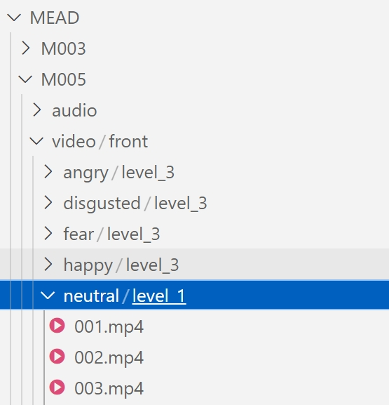

<!--  -->


# SCMCL - Official Implementation
## Learning Symmetrical Cross-Modal Correlations for Speech-Preserving Facial Expression Manipulation

 


## 1. Installation


Create a conda environment and install the requirements.
  ```bash
  conda env create -f environment.yml
  conda activate SCMCL
  ```  

Follow the instructions in [DECA](https://github.com/YadiraF/DECA) (under the *Prepare data* section) to acquire the 3 files ('generic_model.pkl', 'deca_model.tar', 'FLAME_albedo_from_BFM.npz') and place them under "./DECA/data".

## 2. Prepare Dataset

Download the [MEAD](https://wywu.github.io/projects/MEAD/MEAD.html) and [RAVDESS](https://zenodo.org/records/1188976) dataset. 

### 2.1 Reconstruct 3DMM coefficients
We change the directory structure of the RAVDESS dataset to be consistent with that of the MEAD dataset.

The structure of the dataset should look like this:
<div align='left'>
    
</div>

Then we reconstruct 3DMM for specific actors.
```bash
# for SCMC metric
python preprocessing/reconstruct_scmc36.py --root <MEAD_root>

# for expression manipulator
python preprocessing/reconstruct_DECA.py --root <MEAD_root> --actors M003 M009 W029 M012 M030 W015

python preprocessing/reconstruct_DECA.py --root <RAVDESS_root> --actors Actor_01 Actor_02 Actor_03 Actor_04 Actor_05 Actor_06
```

### 2.2 Preprocess data for renderer
We follow the pipeline of NED to prepare data for renderer. To train or test the method on a specific subject, first create a folder for this subject and place the video(s) of this subject into a "videos" subfolder. 

For example, for testing the method on M003's clip, a structure similar to the following must be created:
```
M003 ----- videos ----- 001.mp4
```
Under the above structure, there are 3 options for the video(s) placed in the "videos" subfolder:
1. Use it as test footage for this actor and apply our method for manipulating his/her emotion.
2. Use this footage to train a neural face renderer on the actor (e.g. use the training video of one of our 6 YouTube actors, or a footage of similar duration for a new identity).
3. Use it only as reference clip for transferring the expressive style of the actor to another subject.

To preprocess the video (face detection, segmentation, landmark detection, 3D reconstruction, alignment) run:
```bash
./scripts/preprocess.sh <celeb_path> <mode>
```
- ```<celeb_path>``` is the path to the folder used for this actor.
- ```<mode>``` is one of ```{train, test, reference}``` for each of the above cases respectively.

After successfull execution, the following structure will be created:

```
<celeb_path> ----- videos -----video.mp4 (e.g. "001.mp4")
                   |        |
                   |        ---video.txt (e.g. "001.txt", stores the per-frame bounding boxes, created only if mode=test)
                   |
                   --- images (cropped and resized images)
                   |
                   --- full_frames (original frames of the video, created only if mode=test or mode=reference)
                   |
                   --- eye_landmarks (landmarks for the left and right eyes, created only if mode=train or mode=test)
                   |
                   --- eye_landmarks_aligned (same as above, but aligned)
                   |
                   --- align_transforms (similarity transformation matrices, created only if mode=train or mode=test)
                   |
                   --- faces (segmented images of the face, created only if mode=train or mode=test)
                   |
                   --- faces_aligned (same as above, but aligned)
                   |
                   --- masks (binary face masks, created only if mode=train or mode=test)
                   |
                   --- masks_aligned (same as above, but aligned)
                   |
                   --- DECA (3D face model parameters)
                   |
                   --- nmfcs (NMFC images, created only if mode=train or mode=test)
                   |
                   --- nmfcs_aligned (same as above, but aligned)
                   |
                   --- shapes (detailed shape images, created only if mode=train or mode=test)
                   |
                   --- shapes_aligned (same as above, but aligned)
```


## 3. Download Pretrained Models

[Release]()


<details><summary>Model Details</summary>

| Model | Description
| :--- | :----------
|scmcl_ckpts/pretrained_weights/manipulator/20_nets.pth | Pretrain weights for manipulator.
|scmcl_ckpts/pretrained_weights/renderer/\<actor\>/05_net_G.pth | Pretrain weights for renderer.
|scmcl_ckpts/manipulator/MEAD/05_nets_finetuned.pth | Manipulator weights in SCMCL trained on the MEAD dataset.
|scmcl_ckpts/manipulator/RAVDESS/05_nets_finetuned.pth | Manipulator weights in SCMCL trained on the RAVDESS dataset.
|scmcl_ckpts/renderer/\<actor\>/01_net_G.pth | Renderer weights in SCMCL.
|scmcl_ckpts/scmc/audio/last.pth | Audio similarity network weights.
|scmcl_ckpts/scmc/3dmm/last.pth | 3DMM similarity network weights.
|scmcl_ckpts/scmc/image/last.pth | Image similarity network weights.
|scmcl_ckpts/scmc/3dmm_finetune/last.pth | Joint-optimized weights of audio-3DMM similarity networks.
|scmcl_ckpts/scmc/image_finetune/last.pth | Joint-optimized weights of audio-image similarity networks.
|scmcl_ckpts/scmc/dists_for_3dmm_\<dataset\>/dists.pkl | Offline calculated audio similarities used to train the manipulator.
|scmcl_ckpts/scmc/dists_for_image_\<dataset\>/dists.pkl | Offline calculated audio similarities used to train the renderer.
</details>

## 3. Training

- Train SCMC metric on the MEAD dataset.
  ```bash
  # get alignment
  python scmc/align_by_audios.py 

  # train audio similarity
  python scmc/train_audio.py

  # train 3dmm similarity
  python scmc/train_3dmm.py

  # train image similarity
  python scmc/train_image.py

  # finetuen 3dmm-audio
  python scmc/finetune_3dmm.py

  # finetune image-audio
  python scmc/finetune_image.py
  ```

- Compute audio similarity.
  ```bash
  # for 3dmm 
  python scmc/compute_dist.py --ckpt exp/scmc/3dmm_finetune/last.pth --save_dir exp/scmc/dists_for_3dmm
  # for image
  python scmc/compute_dist.py --ckpt exp/scmc/image_finetune/last.pth --save_dir exp/scmc/dists_for_image
  ```

- Train expression manipulator.
  ```bash
  ./scripts/train_manipulator.sh
  ```
  The pretrained weights "pretrained_weights/manipulator/20_nets.pth" need to be put into <checkpoints_dir> before training.

  The default args in this script is for MEAD dataset. Please modify the <train_root> and <selected_actors> when training on the RAVDESS dataset.

- Train face renderer.

   We train the renderer for each actor.
   ```bash
   ./scripts/train_renderer.sh <actor>
   ```
   We load the pretrained weights "pretrained_weights/renderer/\<actor\>" obtained from NED to reduce training iterations.

   Please modify the args when training on the RAVDESS dataset. The model weight will be saved to "<checkpoints_dir>/export/01_net_G.pth".

## 4. Test
```bash
./scripts/test.sh <args>

python postprocessing/images2video.py --imgs_path <images_path> --out_path <out_path> --audio <original_video_path>
```

## Acknowledgements

Codes are borrowed heavily from [NED](https://github.com/foivospar/NED).  We thank for their wonderful work.
